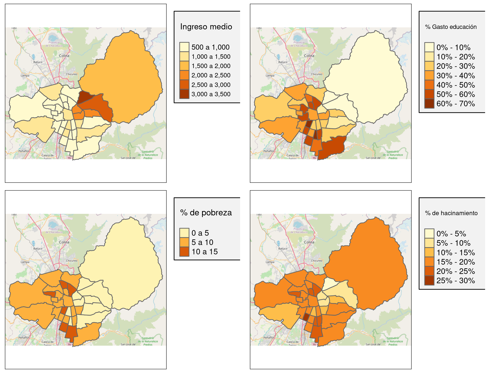

---
output:
  pdf_document:
    extra_dependencies:
      enumitem: ["shortlabels"]
      booktabs: null
      array: null
      arydshln: null
      caption: null
    includes:
      before_body: www/title_page.tex
bibliography: references.bib
nocite: '@*'
urlcolor: blue
---

```{=tex}
\renewcommand{\tablename}{Tabla}
\renewcommand{\figurename}{Figura}
\captionsetup[figure]{skip=0pt}
```
```{r librerias, include=FALSE}
# Datos espaciales
library(sf)

# Análisis espacial
library(rgeoda)
library(spdep)
library(tmap)
library(CARBayes)
library(coda)

# Manejo de datos
library(dplyr)
library(ggplot2)
library(readxl)
library(patchwork)
```

```{r cargas globales, include=FALSE}
presidenciales_santiago <- readRDS("datos/presidenciales_santiago.rds")
basemap <- readRDS("datos/basemap.rds")
```

# Introducción

La participación electoral se define como el porcentaje de personas con derecho a voto, los cuales no necesariamente son todos los adultos de la población, que efectivamente votaron dentro de una elección. Esta participación es fundamental para la democracia, ya que es lo que entrega legitimidad al sistema político y a los integrantes que la componen.

Pese a lo anterior, se ha observado que la tasa de participación electoral ha ido disminuyendo en los últimos 25 años [@PNUD]. En nuestro país, por ejemplo, en las elecciones parlamentarias del año 1990 el porcentaje de votos fue de 86.9%, mientras que en el 2016 fue de un 50.9%, una baja considerable de 36 puntos. No solo eso, sino que además el año 2015 Chile fue el país con el mayor porcentaje de abstinencia dentro de los países con voto voluntario.

Pese a lo anterior, el año 2020 se pudo observar un alza importante en la participación política, donde en el plebiscito para una nueva constitución votó cerca del 50.9% del padrón electoral, lo cual nos llevó a pensar que ocurrió un cambio en cómo la gente se relaciona con las elecciones. Pese a esto, en las elecciones para gobernadores regionales del año 2021 sólo participó un 19.6% del padrón electoral en la segunda vuelta, uno de los porcentajes de participación mas bajos en la historia de nuestro país.

En el presente trabajo estudiaremos las variables que influyen en esta tasa de participación en la ciudad de Santiago, segmentando por comuna, así como estudiar la asociación que existe entre comunas vecinas a través de efectos espaciales. Los datos electorales fueron obtenidos del Servicio Electoral de Chile (SERVEL) para las elecciones presidenciales del año 2017. Por otro lado, los datos comunales fueron obtenidos de la Encuesta Casen 2017, de la Biblioteca del Congreso Nacional de Chile y del Sistema Nacional de Información Municipal.

De manera específica, y dada la naturaleza de los datos, trabajaremos con modelos lineales generalizados mixtos para datos areales, donde introducimos los efectos espaciales por comuna en la segunda etapa de la especificación, a partir de modelos CAR en diferentes versiones. Para esto usaremos el paquete `CARBayes` en R, con el cual podemos definir diferentes prioris para los efectos espaciales.

# Datos y Análisis Exploratorio

La construcción de los datos a utilizar en el presente informe está compuesta de tres partes:

-   Polígonos de las comunas de Santiago, obtenidas de la [Biblioteca del Congreso Nacional](https://www.bcn.cl/siit/mapas_vectoriales/index_html).

-   Número de inscritos y número de votos para las elecciones presidenciales del año 2017, obtenidas del [Servicio Electoral de Chile](https://historico.servel.cl/).

-   Datos comunales: ingreso medio (en miles de pesos), porcentaje de gasto en educación y salud, y los porcentajes de pobreza, hogares hacinados y personas sin servicios básicos, obtenidas de la [Encuesta Casen 2017](http://observatorio.ministeriodesarrollosocial.gob.cl/encuesta-casen-2017), la [Biblioteca del Congreso Nacional](https://www.bcn.cl/siit/reportescomunales/comunal.html?unidad=Comunales&anno=2017) y el [Sistema Nacional de Información Municipal](http://datos.sinim.gov.cl/index.php).

Para nuestro trabajo, nuestro interés principal está en la tasa de participación, la cual se define como la razón del número de votantes sobre el número de inscritos. En la Figura 1 se presenta la tasa de participación en la primera vuelta de las elecciones presidenciales del año 2017, para cada una de las comunas de la capital. A partir de la figura es posible ver que las comunas suelen tener vecinos con tasas de participación similares, sobre todo las comunas del sector oriente como Lo Barnechea, Las Condes y Vitacura, las cuales tienen una tasa de participación mayor al 65%.

```{r mapa tasa part 2017 2, echo=FALSE, fig.cap="Tasa de participación electoral para las comunas de Santiago en la segunda vuelta de las elecciones presidenciales del año 2017.", message=FALSE, fig.height=2.5}
mapa_tasa_participacion <- function(año, vuelta){
  titulo_plot <- paste("Participación electoral año", año)
  
  tm_shape(basemap) +
    tm_rgb() +
    tm_shape(presidenciales_santiago) +
    tm_borders() +
    tm_fill(paste("tasa_participación", año, vuelta, sep = "_"),
            title = "Tasa de participación", breaks = seq(0.3, 0.8, 0.05),
            legend.format = list(text.separator = "-",
                                 fun=function(x) paste0(
                                   formatC(x*100, digits = 0, format="f"), "%"))) +
    tm_layout(main.title = titulo_plot, main.title.size = 1.5,
              legend.outside = TRUE, legend.outside.size = 0.2,
              legend.text.size = 1.5, legend.title.size = 1.7, 
              legend.bg.color = "gray95", legend.frame = TRUE)
}

mapa_tasa_participacion(2017, 1)
```

De la misma manera, podemos ver algunas de nuestras covariables en cada comuna. En la Figura 2 se presenta el ingreso medio por comuna, el gasto en educación, el porcentaje de pobreza y el porcentaje de hacinamiento. En este caso la presencia de autocorrelación no parece evidente, así como correlación con la tasa de participación. Pasamos entonces a estudiar de manera más formal la presencia de autocorrelación y clusters para la tasa de participación en la siguiente sección.



# Análisis de Autocorrelación Espacial

Como pudimos observar en el análisis exploratorio de los datos, es posible notar que existe autocorrelación espacial, esto es, las comunas suelen tener características similares a sus vecinos, tanto para la tasa de participación como para algunas de las covariables. Para el estudio formal de autocorrelación veremos el coeficiente I de Moran y el coeficiente C de Geary como medidas globales, e introduciremos una medida local de autocorrelación denominada estadísticos de Getis-Ord, la cual es utilizada para identificar clusters. Decidimos incluir una medida local ya que, como se puede apreciar de la Figura 3, cada una de las comunas tiene al menos 3 vecinos, por lo que tenemos información suficiente para el estudio por separado.

```{r mapa vecinos, echo=FALSE, warning=FALSE, fig.cap="Mapa de vecinos para la provincia de Santiago, utilizando una matriz de adyacencia Queen", fig.height=2.5}
vecinos_santiago <- spdep::poly2nb(presidenciales_santiago, queen = TRUE)

lineas_vecinos <- listw2lines(nb2listw(vecinos_santiago),
                              coords = presidenciales_santiago$geometry)

matriz_adyacencia <- nb2mat(vecinos_santiago, style = "B")

tm_shape(basemap) +
  tm_rgb() +
  tm_shape(presidenciales_santiago) +
  tm_polygons(col = "lightblue") +
  tm_shape(lineas_vecinos) +
  tm_lines() +
  tm_layout(main.title = "Comunas vecinas dentro de Santiago",
            main.title.size = 1.5, asp = 1.3)
```

## Coeficiente I de Moran y Coeficiente C de Geary

En la Figura 3 se presenta de manera conjunta la densidad aproximada del coeficiente I de Moran (arriba) y el coeficiente C de Geary (abajo), obtenidas a partir de permutaciones en los datos, junto con el valor observado. Vemos que en ambos casos el valor observado es muy lejano, por lo que tenemos evidencia de que existe autocorrelación espacial positiva para la tasa de participación en el año 2017, dado que el valor obtenido es mayor a 0 en el caso de Moran y menor a 1 en el caso de Geary.

```{r graficos de Moran y Geary, echo=FALSE, fig.cap="Densidad aproximada del coeficiente I de Moran y C de Geary, elecciones año 2017, junto al valor observado (en celeste)", fig.height=4}
set.seed(1122)

grafico_moran <- function(año, vuelta){
  titulo <- paste("Coeficiente de Moran")
  
  moran_test <- spdep::moran.mc(presidenciales_santiago$tasa_participación_2017_1,
                                listw = nb2listw(vecinos_santiago, style = "B"),
                                nsim = 5000)
  
  simulaciones <- moran_test$res
  simulaciones <- simulaciones[seq_len(length(simulaciones) - 1)]
  observado <- moran_test$statistic
  
  ggplot(as_tibble(simulaciones)) +
    geom_density(aes(x = value)) +
    geom_vline(xintercept = observado, lwd = 1, lty = "dashed", col = "red") +
    xlim(-0.5, 0.5) +
    labs(title = titulo, y = "Densidad", x = "I")
}

grafico_geary <- function(año, vuelta){
  titulo <- paste("Coeficiente de Geary")
  
  geary_test <- spdep::geary.mc(presidenciales_santiago$tasa_participación_2017_1,
                                listw = nb2listw(vecinos_santiago, style = "B"),
                                nsim = 5000)
  
  simulaciones <- geary_test$res
  simulaciones <- simulaciones[seq_len(length(simulaciones) - 1)]
  observado <- geary_test$statistic
  
  ggplot(as_tibble(simulaciones)) +
    geom_density(aes(x = value)) +
    geom_vline(xintercept = observado, lwd = 1, lty = "dashed", col = "red") +
    xlim(0.45, 1.6) +
    labs(title = titulo, y = "Densidad", x = "C")
}

moran_2017 <- grafico_moran(2017, 1)
geary_2017 <- grafico_geary(2017, 1)

pathchwork_autocorrelacion <- moran_2017 / geary_2017

pathchwork_autocorrelacion +
  plot_annotation(title = "Participación electoral año 2017")
```

## Coeficiente de Getis-Ord

El coeficiente de Getis-Ord [@getisord] fue propuesto para estudiar la autocorrelación espacial local. Existen dos versiones, una que toma en cuenta el valor en la localización, denominada $G_i^*$, y otra que no, denominada $G_i$.

La definición específica está dada por:

$$
G_i = \frac{\sum_{j\neq i} w_{ij}x_j}{\sum_{j\neq i}x_j}\quad \text{y} \quad  G_i^* = \frac{\sum_{j}w_{ij}x_j}{\sum_{j}x_j}
$$

esto es, es una razón de la suma ponderada de los valores vecinos (e incluyendo a sí mismo en el caso de $G_i^*$) sobre la suma de todos los valores.

Un valor alto de $G$ más alto que la media sugiere un cluster de valores altos, denominado normalmente como High-High o "hot spot", mientras que un valor más bajo que la media sugiere un cluster de valores bajos, denominado Low-Low o "cold spot".

De manera similar a el coeficiente de Moran y Geary, se sugiere hacer inferencia a partir de permutaciones de los datos, obteniendo el coeficiente para cada permutación y finalmente comparar con el valor obtenido. Para el cálculo del estadístico se utilizó el paquete `rgeoda` [@RGEODA], el cual nos entrega las regiones con un coeficiente significativo, indicando además si son hot spots o cold spots.

En la Figura 5 se presenta el mapa con las comunas indicadas como hot spot de rojo y las indicadas como cold spot de azul. Las comunas sin color significa que no tenemos suficiente evidencia para concluir la presencia de clusters.

```{r local g star, echo=FALSE, fig.cap="Clusters identificados por los estadísticos de Getis y Ord, en rojo para valores altos y en azul para valores bajos", fig.height=3}
set.seed(1122)
pesos_rgeoda <- rgeoda::queen_weights(presidenciales_santiago)
gstar_rgeoda <- rgeoda::local_gstar(
  pesos_rgeoda, presidenciales_santiago["tasa_participación_2017_1"], permutations = 2000, significance_cutoff = 0.1)

lisa_colors <- lisa_colors(gstar_rgeoda)
lisa_labels <- lisa_labels(gstar_rgeoda)
lisa_clusters <- lisa_clusters(gstar_rgeoda)

tm_shape(basemap) +
  tm_rgb() +
  tm_shape(
    dplyr::mutate(presidenciales_santiago,
                  gstar = sapply(lisa_clusters, function(x){lisa_colors[[x + 1]]}))) +
  tm_borders() +
  tm_fill("gstar") +
  tm_layout(main.title = "Clusters identificados en la participación electoral 2017",
            main.title.size = 2, title.size = 1, asp = 1.8)
```

A partir de la figura vemos que, como habíamos notado en la sección de análisis exploratorio, existe un cluster de comunas con alta tasa de participación correspondiente a las comunas del sector oriente de la capital: Lo Barnechea, Vitacura, Las Condes, Providencia, La Reina y Peñalolén, agregando también la comuna de Huechuraba. También vemos que hay dos clusters de tasa baja de participación, una compuesta por las comunas de Independencia, Renca, Quinta Normal y Lo Prado, mientras que la otra está compuesta de San Miguel, San Ramón, Pedro Aguirre Cerda, El Bosque, La Pintana y La Florida.

# Modelamiento

Para modelar nuestros datos, usaremos el paquete `CARBayes` [@CARBAYES], el cual nos permite ajustar modelos lineales mixtos generalizados, a partir del punto de vista bayesiano, en el cual los efectos aleatorios corresponden a las áreas de estudio, que en este caso son nuestras comunas. El paquete nos entrega diferentes prioris para estos efectos, con las cuales trabajaremos a continuación.

Específicamente, la librería ajusta, de manera general, el siguiente modelo:

$$
\begin{aligned}
Y_k|\mu_k &\sim f(y_k|\mu_k, \nu^2), \quad k = 1, ..., K \\
g(\mu_k) &= x_k^T\beta + O_k + \psi_k \\
\beta &\sim \text{N}(\mu_\beta, \Sigma_\beta) \\
\nu^2 &\sim \text{Inv-Gamma}(a, b)
\end{aligned}
$$

donde $K$ es el número de áreas (comunas), $\mathbf{Y} = (Y_1, ..., Y_k)$ el vector de respuestas (cantidad de votos), $O_k$ las exposiciones (específicamente, el log de éstos). Además, $\mathbf{x}_k$ corresponde a las covariables para la $k$-ésima área, $E(Y_k) = \mu_k$ y $\beta = (\beta_1, ..., \beta_p)$ el vector de parámetros de la regresión.

La variable respuesta puede ser modelada con cuatro distribuciones: Binomial, Normal, Poisson y Poisson cero-inflada. Como nuestros datos corresponden a conteos con una cantidad máxima posible (la cantidad de electores inscritos), usaremos la distribución binomial, esto es, $Y_k \sim \text{Binomial}(n_k, \theta_k)$, con $\log(\theta_k/(1 - \theta_k)) = \mathbf{x}_k^T\beta + O_k + \psi_k$.

## Modelo sin efectos especiales

La librería `CARBayes` también nos permite ajustar un modelo lineal generalizado, sin incluir los efectos espaciales, esto es, $\psi_k = 0$ para todo $k$. Ajustamos este modelo para así tener una base de referencia al momento de ajustar los otros modelos que sí incluyen los efectos.

```{r modelo sin efectos, echo=FALSE, message=FALSE, warning=FALSE, cache=TRUE}
formula <- votos_2017_1 ~ ingreso_medio + porcentaje_pobreza + 
  porcentaje_personas_sin_servicios_basicos + porcentaje_hacinamiento +
  tasa_gasto_salud + tasa_gasto_educacion

### Cadenas
set.seed(2211)
glm_c1 <- S.glm(formula = formula, family = "binomial", data = presidenciales_santiago,
                trials = presidenciales_santiago$inscritos_2017_1, burnin = 20000,
                n.sample = 40000, thin = 20, verbose = FALSE)

glm_c2 <- S.glm(formula = formula, family = "binomial", data = presidenciales_santiago,
                trials = presidenciales_santiago$inscritos_2017_1, burnin = 20000,
                n.sample = 40000, thin = 20, verbose = FALSE)

glm_c3 <- S.glm(formula = formula, family = "binomial", data = presidenciales_santiago,
                trials = presidenciales_santiago$inscritos_2017_1, burnin = 20000,
                n.sample = 40000, thin = 20, verbose = FALSE)

beta_samples_glm <- mcmc.list(glm_c1$samples$beta,
                              glm_c2$samples$beta,
                              glm_c3$samples$beta)

rhat_glm <- coda::gelman.diag(beta_samples_glm)
geweke_glm <- coda::geweke.diag(beta_samples_glm)
```


## Modelo de Besag-York-Mollie

En este caso, los efectos espaciales están modelados como:

$$
\begin{aligned}
\psi_k &= \phi_k + \theta_k \\
\phi_k|\phi_{-k}, \text{W}, \tau^2 &\sim \text{N}\left(\frac{\sum_{i=1}^K w_{ki}\phi_k}{\sum_{i=1}^K w_{ki}}, \frac{\tau^2}{\sum_{i=1}^K w_{ki}}\right) \\
\theta_k &\sim \text{N}(0, \sigma^2) \\
\tau^2, \sigma^2 &\sim \text{Inv-Gamma(a, b)}
\end{aligned}
$$

donde $\text{W}$ es la matriz de adyacencia que obtuvimos anteriormente, y $\mathbb{\theta} = (\theta_1, ..., \theta_K)$ son efectos aleatorios independientes y los efectos espaciales son modelados por $\phi = (\phi_1, ..., \phi_K)$. Es importante notar que este modelo no es identificable en $\theta_k$ y $\phi_k$, pero sí en $\psi_k$.

```{r modelo bym, echo=FALSE, message=FALSE, warning=FALSE}
load("./datos/bym.RData")

## Betas
beta_samples_bym <- mcmc.list(bym_c1$samples$beta,
                              bym_c2$samples$beta,
                              bym_c3$samples$beta)

rhat_bym_beta <- coda::gelman.diag(beta_samples_bym)
geweke_bym_beta <- coda::geweke.diag(beta_samples_bym)

## Psi
psi_samples_bym <- mcmc.list(bym_c1$samples$psi,
                             bym_c2$samples$psi,
                             bym_c3$samples$psi)

rhat_bym_psi <- coda::gelman.diag(psi_samples_bym)
geweke_bym_psi <- coda::geweke.diag(psi_samples_bym)

## Tau2
tau_samples_bym <- mcmc.list(bym_c1$samples$tau2,
                             bym_c2$samples$tau2,
                             bym_c3$samples$tau2)

rhat_bym_tau2 <- coda::gelman.diag(tau_samples_bym)
geweke_bym_tau2 <- coda::geweke.diag(tau_samples_bym)

## Sigma2
sigma2_samples_bym <- mcmc.list(bym_c1$samples$sigma2,
                                bym_c2$samples$sigma2,
                                bym_c3$samples$sigma2)

rhat_bym_sigma2 <- coda::gelman.diag(sigma2_samples_bym)
geweke_bym_sigma2 <- coda::geweke.diag(sigma2_samples_bym)
```

## Modelo de Leroux

Este modelo es similar al anterior, pero se agrega un parámetro $\rho$ de la siguiente manera:

$$
\begin{aligned}
\psi_k &= \phi_k \\
\phi_k|\phi_{-k}, \text{W}, \tau^2 &\sim \text{N}\left(\frac{\rho\sum_{i=1}^K w_{ki}\phi_i}{\rho\sum_{i=1}^K w_{ki} + 1 - \rho}, \frac{\tau^2}{\rho\sum_{i=1}^Kw_{ki} + 1 - \rho}\right) \\
\tau^2 &\sim \text{Inv-Gamma}(a,b) \\
\rho &\sim \text{Uniforme}(0, 1)
\end{aligned}
$$


Notar que cuando $\rho = 1$ se obtiene el modelo ICAR visto en clases, mientras que con $\rho = 0$ hay independencia espacial.

```{r modelo leroux, echo=FALSE, message=FALSE, warning=FALSE}
# ler_c1 <- S.CARleroux(formula, family = "binomial", data = presidenciales_santiago,
#                       trials = presidenciales_santiago$inscritos_2017_1,
#                       W = matriz_adyacencia, burnin = 200000, n.sample = 300000,
#                       thin = 200, verbose = FALSE)
# 
# ler_c2 <- S.CARleroux(formula, family = "binomial", data = presidenciales_santiago,
#                       trials = presidenciales_santiago$inscritos_2017_1,
#                       W = matriz_adyacencia, burnin = 200000, n.sample = 300000,
#                       thin = 200, verbose = FALSE)
# 
# ler_c3 <- S.CARleroux(formula, family = "binomial", data = presidenciales_santiago,
#                       trials = presidenciales_santiago$inscritos_2017_1,
#                       W = matriz_adyacencia, burnin = 200000, n.sample = 300000,
#                       thin = 200, verbose = FALSE)
# 
# 
# saveRDS(ler_c1, "datos/ler1.rds")
# saveRDS(ler_c2, "datos/ler2.rds")
# saveRDS(ler_c3, "datos/ler3.rds")

ler_c1 <- readRDS("datos/ler1.rds")
ler_c2 <- readRDS("datos/ler2.rds")
ler_c3 <- readRDS("datos/ler3.rds")

## Betas
beta_samples_ler <- mcmc.list(ler_c1$samples$beta,
                              ler_c2$samples$beta,
                              ler_c3$samples$beta)

rhat_ler_beta <- coda::gelman.diag(beta_samples_ler)
geweke_ler_beta <- coda::geweke.diag(beta_samples_ler)

## Phi
phi_samples_ler <- mcmc.list(ler_c1$samples$phi,
                             ler_c2$samples$phi,
                             ler_c3$samples$phi)

# rhat_ler_phi <- coda::gelman.diag(phi_samples_ler)
geweke_ler_phi <- coda::geweke.diag(phi_samples_ler)

## Tau2
tau_samples_ler <- mcmc.list(ler_c1$samples$tau2,
                             ler_c2$samples$tau2,
                             ler_c3$samples$tau2)

rhat_ler_tau2 <- coda::gelman.diag(tau_samples_ler)
geweke_ler_tau2 <- coda::geweke.diag(tau_samples_ler)

## Rho
rho_samples_ler <- mcmc.list(ler_c1$samples$rho,
                             ler_c2$samples$rho,
                             ler_c3$samples$rho)

rhat_ler_rho <- coda::gelman.diag(rho_samples_ler)
geweke_ler_rho <- coda::geweke.diag(rho_samples_ler)
```

## Modelo localised

Los dos modelos anteriores realizan un suavizamiento espacial global. El problema con estos modelos es que pueden simplificar mucho el problema si es que la región no pareciera comportarse de manera uniforme. Por ejemplo, de la Figura 1, parece ser que existe una correlación alta entre las comunas del sector oriente de la capital, pero no pareciera ser correcto asumir los mismo niveles de correlación en otros sectores de la capital.

El modelo localised es utilizado para capturar autocorrelación espacial localizada. La forma en que hace esto es aumentando el conjunto de efectos espaciales $\phi$ con interceptos constantes, particionando las $K$ áreas en un máximo de $G$ clusters, cada uno con su propio intercepto $\lambda_g$.

En nuestro caso, tomaremos $G = 4$ dado lo observado en la Figura 5, ya que identificamos tres clusters en ese caso, y dejaremos abierta la posibilidad de un cuarto cluster.

No incluiremos los detalles de este modelo en el informe, ya que lo alargaríamos en demasía, pero los detalles se encuentran en [@LeeDuncan2015Cfuc].

```{r modelo localised, echo=FALSE, warning=FALSE, message=FALSE}
# loc_c1 <- S.CARlocalised(formula, family = "binomial", data = presidenciales_santiago,
#                          trials = presidenciales_santiago$inscritos_2017_1, G = 4,
#                          W = matriz_adyacencia, burnin = 200000, n.sample = 300000,
#                          thin = 200, verbose = FALSE)
# 
# loc_c2 <- S.CARlocalised(formula, family = "binomial", data = presidenciales_santiago,
#                          trials = presidenciales_santiago$inscritos_2017_1, G = 4,
#                          W = matriz_adyacencia, burnin = 200000, n.sample = 300000,
#                          thin = 200, verbose = FALSE)
# 
# loc_c3 <- S.CARlocalised(formula, family = "binomial", data = presidenciales_santiago,
#                          trials = presidenciales_santiago$inscritos_2017_1, G = 4,
#                          W = matriz_adyacencia, burnin = 200000, n.sample = 300000,
#                          thin = 200, verbose = FALSE)
# 
# 
# saveRDS(loc_c1, "datos/loc1.rds")
# saveRDS(loc_c2, "datos/loc2.rds")
# saveRDS(loc_c3, "datos/loc3.rds")

loc_c1 <- readRDS("datos/loc1.rds")
loc_c2 <- readRDS("datos/loc2.rds")
loc_c3 <- readRDS("datos/loc3.rds")

## Betas
beta_samples_loc <- mcmc.list(loc_c1$samples$beta,
                              loc_c2$samples$beta,
                              loc_c3$samples$beta)

rhat_loc_beta <- coda::gelman.diag(beta_samples_loc)
geweke_loc_beta <- coda::geweke.diag(beta_samples_loc)

## Phi
phi_samples_loc <- mcmc.list(loc_c1$samples$phi,
                             loc_c2$samples$phi,
                             loc_c3$samples$phi)

# rhat_loc_phi <- coda::gelman.diag(phi_samples_loc)
geweke_loc_phi <- coda::geweke.diag(phi_samples_loc)

## Lambda
lambda_samples_loc <- mcmc.list(loc_c1$samples$lambda,
                                loc_c2$samples$lambda,
                                loc_c3$samples$lambda)

rhat_loc_lambda <- coda::gelman.diag(lambda_samples_loc)
geweke_loc_lambda <- coda::geweke.diag(lambda_samples_loc)

## Tau2
tau2_samples_loc <- mcmc.list(loc_c1$samples$tau2,
                              loc_c2$samples$tau2,
                              loc_c3$samples$tau2)

rhat_loc_tau2 <- coda::gelman.diag(tau2_samples_loc)
geweke_loc_tau2 <- coda::geweke.diag(tau2_samples_loc)
```

## Resultados

Utilizando la librería ajustamos los cuatro modelos propuestos. Cada uno de los modelos considera de manera común los parámetros de la regresión, y luego se van diferenciando en los otros que van incluyendo.

Sobre los resultados obtenidos, tenemos que solo para el modelo sin efectos espaciales tenemos evidencia de convergencia a la distribución estacionaria, con valores de Geweke entre $-1.96$ y $1.96$, y valores de $\hat{R}$ bajo el $1.01$ (al menos de manera puntual). En este caso, fue necesario un periodo de quema de 20000 iteraciones para obtener la convergencia.

Por otro lado, en ninguno de los tres modelos que incluyen efectos espaciales tenemos evidencia de convergencia. En todos los casos probamos hasta con 1 millón de iteraciones para el periodo de quema, sin obtener resultados positivos. Intentamos también usar JAGS y Stan, sin obtener mejores resultados. Un ejemplo de los valores obtenidos se presenta en la Tabla 1, que entrega los valores de $\hat{R}$ para el vector $\beta$ en el modelo de Besag-York-Mollie.

```{r tabla rhat bym, echo=FALSE}
aux <- rhat_bym_beta$psrf
rownames(aux) <- c("Intercepto", "Ingreso medio", "Pobreza", 
                   "Sin Servicios Básicos", "Hacinamiento", "Gasto en salud",
                   "Gasto en educación")
  
kableExtra::kbl(aux,
                col.names = c("Estimación puntual", "Límite superior IC"),
                booktabs = TRUE, centering = TRUE, row.names = TRUE,
                caption = paste("Valores del factor de reducción de escala potencial para los parámetros de regresión en el modelo de Besag-York-Mollie"))
```

En lo que queda de esta sección asumiremos convergencia de nuestras cadenas, por lo que los resultados y conclusiones que siguen no son correctos (o al menos no sabemos si realmente lo son).

Para poder elegir entre los cuatro modelos, podemos utilizar el Criterio de Información de la Devianza y el Criterio de Información de Watanabe-Akaike, entregados por el paquete utilizado. En la Tabla 2 se presentan los cuatro DIC y WAIC obtenidos.

```{r tabla DIC y WAIC, echo=FALSE}
DIC_glm <- as.vector(glm_c1$modelfit[1])
DIC_bym <- as.vector(bym_c1$modelfit[1])
DIC_ler <- as.vector(ler_c1$modelfit[1])
DIC_loc <- as.vector(loc_c1$modelfit[1])

WAIC_glm <- as.vector(glm_c1$modelfit[3])
WAIC_bym <- as.vector(bym_c1$modelfit[3])
WAIC_ler <- as.vector(ler_c1$modelfit[3])
WAIC_loc <- as.vector(loc_c1$modelfit[3])

kableExtra::kbl(data.frame(c(DIC_glm, WAIC_glm),
                           c(DIC_bym, WAIC_bym),
                           c(DIC_ler, WAIC_ler),
                           c(DIC_loc, WAIC_loc), row.names = c("DIC", "WAIC")),
                col.names = c("Sin efectos", "BYM", "Leroux", "Localised"),
                booktabs = TRUE, centering = TRUE, row.names = TRUE,
                caption = paste("Valores de DIC y WAIC para cada uno de los modelos ajustados"))
```

A partir de la tabla es posible ver que el modelo sin efectos espaciales tiene un DIC y WAIC mucho mayor que los demás. Entre los que incluyen efectos espaciales, vemos que el modelo propuesto por Leroux tiene tanto un DIC como un WAIC menor que los demás, por lo que concluimos que éste es el "mejor" modelo.

En la Tabla 3 se presenta la mediana y un intervalo de credibilidad de $95\%$ para cada uno de los parámetros ajustados en el modelo.

```{r tabla param post, echo=FALSE}
aux <- as_tibble(ler_c1$summary.results)
aux$parametro <- c("Intercepto", "Ingreso medio", "% Pobreza", "% sin Servicios Básicos",
                   "% Hacinados", "Gasto salud", "Gasto educación", "tau", "rho")

aux <- aux %>% 
  select(parametro, Median, `2.5%`, `97.5%`)

kableExtra::kbl(
  aux, col.names = c("Parámetro", "Mediana", "Límite inferior IC", "Límite superior IC"),
  booktabs = TRUE, centering = TRUE, caption = paste("Inferencia a posteriori de los",
                                                     "parámetros en el modelo de Leroux"))

```

A partir de la Tabla 3 podemos ver que los intervalos de credibilidad del intercepto, porcentaje de viviendas sin servicios básicos, porcentaje de hogares hacinados, gasto municipal en salud y gasto municipal en educación contienen al 0, por lo que tenemos evidencia que aquellas variables no son significativas para el estudio de la tasa de participación electoral.

Por otro lado, las covariables que sí son significativas son el ingreso medio y el porcentaje de pobreza, donde el logit del parámetro aumenta en 0.03 por cada cien mil pesos que aumenta el ingreso medio, y disminuye a medida que aumenta la tasa de pobreza.

En cuanto al valor de $\rho$, que nos entrega el nivel de suavizamiento espacial, vemos que el intervalo de credibilidad es bastante ancho entre el 0.0077 y 0.7499. Por su parte, el parámetro $\tau^2$, que entrega de cierta manera el nivel de variabilidad global, tiene una estimación de 0.0307.

# Conclusión

Dado los resultados anteriores, la conclusión es incierta. En caso que sí se pueda concluir convergencia a la distribución estacionaria, tendríamos que el modelo a utilizar sería el propuesto por Leroux, al obtener valores de DIC y WAIC menores, como vimos en la sección anterior.

De este modelo obtuvimos que hay dos covariables para las cuales tenemos evidencia que afectan la tasa de participación electoral: el ingreso medio de la población y el porcentaje de pobreza, donde el primero afecta de manera positiva, mientras que el segundo de manera negativa. Creemos que puede ser sensible lo que se pueda concluir a partir de ésto, considerando que nosotros no entendemos bien los mecanismos sociales que subyacen a la participación política y democrática. Como se menciona en [@PNUD], algunas de las razones por las que existen tasas de participación bajas son: debilitamiento del sistema de representación, rol de los partidos políticos, declive en la percepción de la eficacia política y transformaciones en el mundo juvenil. Sería interesante entonces tratar de generar encuestas que se enfoquen en estas variables dentro de la población, las cuales no se encuentran disponibles actualmente.

En cuanto al análisis espacial, pudimos ver en la sección de Análisis de Autocorrelación Espacial que existen similitudes entre comunas que son vecinas entre sí, por lo que incluir los efectos espaciales logra enriquecer el modelo con esta información que entrega.

Una de nuestras intenciones iniciales era trabajar con modelos espacio-temporales, pero las bases de datos del SERVEL no se encuentran bien optimizadas para obtener datos de antes del 2013, por lo que lo único que pudimos conseguir fueron los resultados del 2013 y del 2017. Además, los espacios de tiempo entre elecciones son grandes, por lo que el efecto temporal puede ser tenue en comparación con el efecto de covariables y el efecto espacial. Un paso natural sería incluir los datos que se obtengan este domingo en las elecciones presidenciales entre Gabriel Boric y José Antonio Kast.

Por último, existe un nuevo tipo de modelo denominado DAGAR [@DattaAbhirup2017Sdmu] el cual puede ser interesante de aplicar como otro paso siguiente al presente informe. Este modelo lo que hace es que, en vez de modelar la matriz de varianzas-covarianzas directamente, modela el factor de Cholesky de esta, dándole un carácter dirigido.

\newpage

# Referencias
